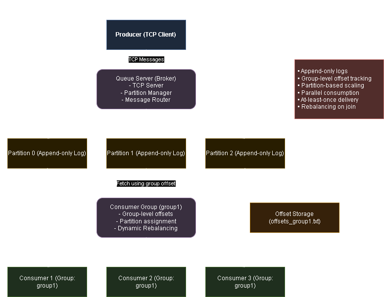

# Distributed Message Queue (Kafka-like System) in Python

## Overview

This project is a simplified, from-scratch implementation of a distributed message queue inspired by systems like Apache Kafka. It demonstrates core concepts of distributed systems, including producer-consumer architecture, message persistence, offset tracking, concurrency handling, and partition-based scaling.

The system is built using low-level Python modules such as `socket`, `threading`, and file I/O, without relying on external frameworks.

---

## Features

- TCP-based communication between clients and server
- Producer → Queue → Consumer architecture
- In-memory and disk-based message persistence
- FIFO message handling within partitions
- Multiple consumers with concurrency control
- Acknowledgment (ACK) mechanism for reliable delivery
- Offset tracking per consumer
- Offset persistence across restarts
- Log-based storage (append-only)
- Partitioning for parallel processing and scalability

---

## Architecture


### Components

#### 1. Producer
- Sends messages to the server over TCP
- Messages are distributed across partitions using round-robin

#### 2. Server
- Accepts producer and consumer connections
- Stores messages in partitioned logs
- Persists messages to disk
- Handles consumer requests using offsets
- Ensures thread-safe operations using locks

#### 3. Consumer
- Reads messages from a specific partition
- Maintains its own offset
- Persists offset to disk for recovery
- Polls server for new messages

---

## Project Structure
```bash
distributed-queue/
│
├── server/
│   ├── server.py
│   ├── partition_0.txt        # Ignored in git
│   ├── partition_1.txt
│   └── partition_2.txt
│
├── producer/
│   └── producer.py
│
├── consumer/
│   ├── consumer.py
│   ├── consumer_id.txt        # Ignored in git
│   └── offsets/               # Ignored in git
│
├── requirements.txt
└── .gitignore
```

---

## Key Concepts Implemented

### 1. Message Queue
Decouples producers and consumers using an intermediate queue.

### 2. TCP Networking
Uses raw sockets for communication instead of frameworks.

### 3. Concurrency Control
Thread-based client handling with locks to prevent race conditions.

### 4. Acknowledgment (ACK)
Messages are only considered processed after explicit acknowledgment.

### 5. Offset Tracking
Consumers track their progress using offsets instead of message deletion.

### 6. Persistence
Messages are written to disk and reloaded on server restart.

### 7. Partitioning
Messages are distributed across multiple partitions to enable parallel consumption.

---

## How to Run

### 1. Start the Server

```bash
cd server
python server.py
```

### 2. Start Producer
```bash
cd producer
python producer.py
```

Enter messages interactively.

### 3. Start Consumer(s)
```bash
cd consumer
python consumer.py
```
Enter partition number (0, 1, or 2).

You can run multiple consumers in different terminals.

---

### Example Flow
**1. Producer sends messages:**
- Hello
- Order 1
- Order 2

**2. Server distributes messages:** 
- Partition 0 → Hello
- Partition 1 → Order 1
- Partition 2 → Order 2

**3. Consumers read independently from partitions.**

---

### Design Decisions
- Append-only logs for durability
- Round-robin partitioning for load distribution
- Offset-based consumption instead of message deletion
- File-based persistence for simplicity
- Polling-based consumption model

---

### Limitations
- No replication or fault tolerance across nodes
- No leader election or cluster management
- Polling-based (no push mechanism)
- No message retention policies
- Single-node architecture

---

### Future Improvements
- Distributed multi-node support
- Replication and fault tolerance
- Consumer groups and load balancing
- Message retention and compaction
- Push-based consumption (event-driven)
- Monitoring and metrics

---

### Requirements
- Python 3.8 or higher
- No external dependencies (standard library only)

---

### Learning Outcomes

This project demonstrates:

- Fundamentals of distributed systems
- Message queue design principles
- Networking using sockets
- Concurrency and synchronization
- Persistence and recovery mechanisms
- Scalable architecture using partitioning